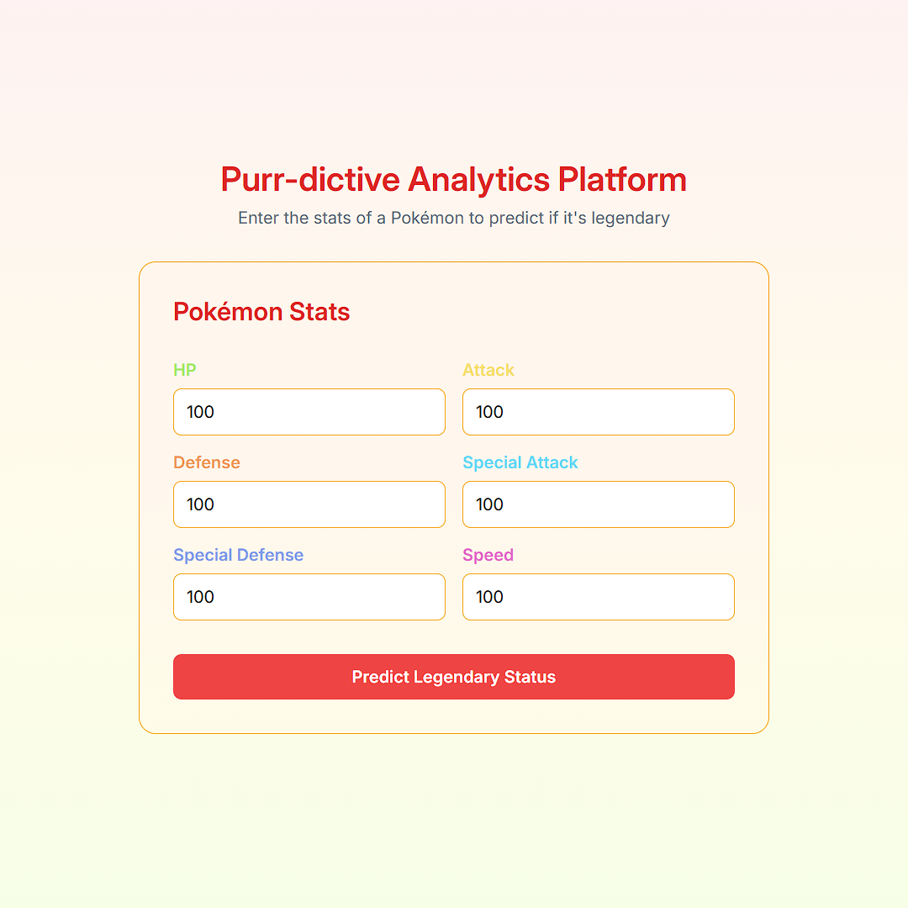

# Purr-dictive Analytics Platform

## Project Description

The **Purr-dictive Analytics Platform** aims to develop a scalable system capable of ingesting and processing large datasets to generate predictive insights using machine learning algorithms. Initially, the focus is on [**The Complete Pokémon Dataset**](https://www.kaggle.com/datasets/rounakbanik/pokemon/data), which provides data on over 800 Pokémon from the first seven generations, including base stats, types, and other categorical features. The platform will implement predictive models to classify Pokémon types and estimate overall strength based on their attributes. For scalability and reliability, the platform leverages containerization (Docker) for cloud deployment (AWS, Azure, or GCP) and utilizes PostgreSQL for efficient data storage.

## Technologies Used

- **Programming Language:** Python
- **AI/ML Libraries:** PyTorch, pandas, scikit-learn
- **Cloud Providers:** AWS, Azure, GCP
- **Database:** PostgreSQL
- **DevOps Tools:** Docker
- **Web Framework:** Django, Django REST Framework
- **Frontend:** HTML, CSS, JavaScript
- **Data Handling:** kagglehub, pandas, matplotlib, seaborn

## Dataset

- **Primary Dataset:** [**The Complete Pokémon Dataset**](https://www.kaggle.com/datasets/rounakbanik/pokemon/data)

## Exploratory Data Analysis (EDA)

Initial data exploration focuses on understanding the characteristics of the Pokémon dataset, including:

- Examining distributions of Pokémon attributes such as types, stats (HP, Attack, Defense, Speed, etc.), and generations.
- Identifying correlations between features, exploring how type combinations and stat distributions influence overall strength.

## Model Training

The platform will implement and train machine learning models to generate predictive insights:

- **Classification Models:** Predict Pokémon primary/secondary types and legendary status based on attributes such as base stats and generation.
- **Regression Models:** Estimate overall Pokémon strength (e.g., total base stats) using features like Attack, Defense, Speed, and special stats.

## Deployment

The platform aims to deliver valuable interactive Pokémon analytics through:

- **Web Interface:** A Django-served HTML page allows users to input Pokémon stats. JavaScript fetches predictions asynchronously.
- **RESTful API:** A Django REST Framework API endpoint (`/api/predict-legendary/`) accepts Pokémon stats (POST request) and returns the predicted legendary status and probability.
- **Containerized Deployment:** Using Docker to containerize the dashboard, API, and model components for consistent environments. Deployment will target a cloud provider (AWS, Azure, or GCP) to ensure scalability and high availability.

## Directory Structure

```
purr-dictive-analytics-platform/
├── data/
│   ├── raw/
│   └── processed/
├── notebooks/
│   └── exploratory_data_analysis.ipynb
├── models/
│   ├── training/
│   └── deployment/
├── src/
│   ├── data_processing/
│   ├── model_training/
│   └── app/
│       ├── static/
│       ├── templates/
│       └── views/
├── tests/
│   ├── data_processing/
│   ├── model_training/
│   └── api/
├── docker/
│   ├── Dockerfile
│   └── docker-compose.yml
├── Makefile
└── requirements.txt
```

### Description of Directory Structure

- `data/`: Original (raw) and transformed (processed) datasets for analysis and model training.
- `notebooks/`: Jupyter notebooks for exploratory data analysis and model experimentation.
- `models/`: Trained machine learning models, including training and deployment scripts.
- `src/`: Core application code organized into modules for data processing, model training, and API services.
- `tests/`: Unit and integration tests for modules in the `src` directory, ensuring code quality.
- `docker/`: Docker configuration files (`Dockerfile`, `docker-compose.yml`) for containerization and orchestration.
- `Makefile`: Defines commands for common development tasks.
- `requirements.txt`: Lists Python dependencies needed to run the project.

## How to Build and Use

Follow these steps to get the Purr-dictive Analytics Platform running locally:

1. **Clone the repository:**

   ```bash
   git clone https://github.com/suarezsandicamilo/purr-dictive-analytics-platform.git
   cd purr-dictive-analytics-platform
   ```

2. **Set up the environment and run the application:**

- **Create the virtual environment and activate it:**

  ```bash
  make setup
  source venv/bin/activate
  ```

- **Install dependencies:**

  ```bash
  make install
  ```

- **Process data:**

  ```bash
  make process
  ```

- **Train the model:**

  ```bash
  make train
  ```

- **Start the server:**

  ```bash
  make runserver
  ```

3.  **Access the application:**

    Open your web browser and navigate to `http://localhost:8000` (or the port shown in the `make runserver` output).

4.  **Interact with the platform:**

    Enter the Pokémon stats into the web form and click "Predict Legendary Status" to see the prediction.

### Screenshot


